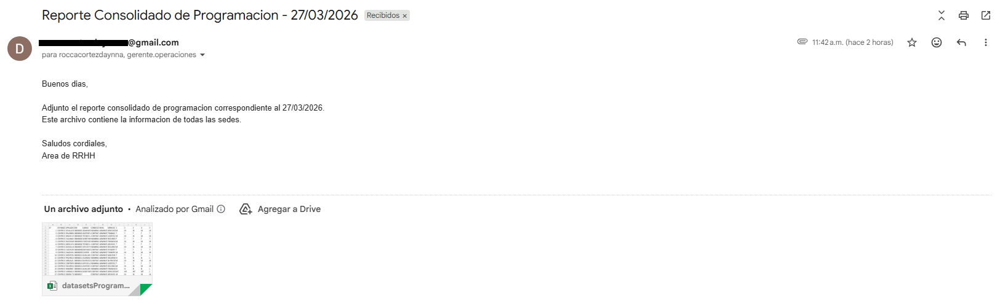
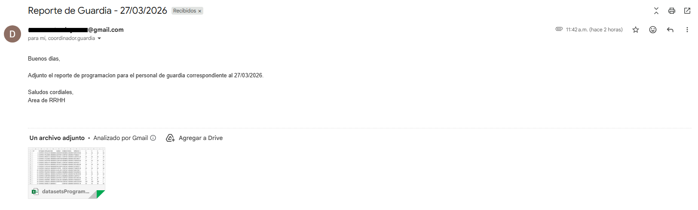
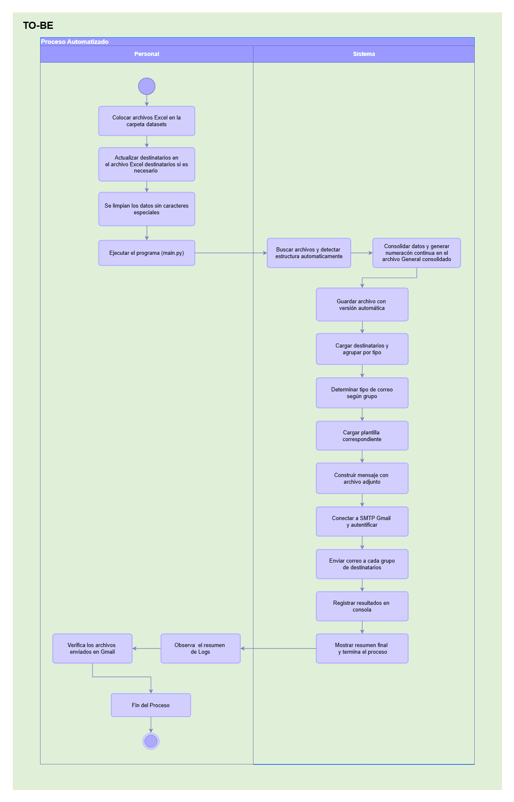
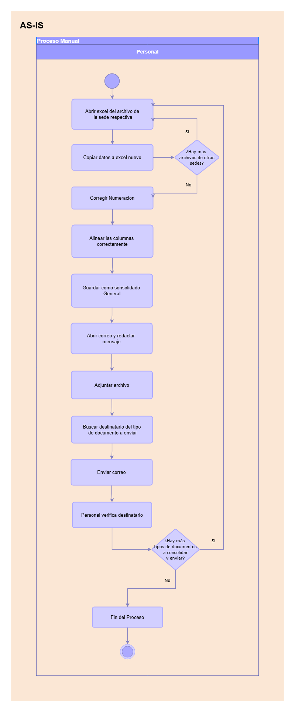
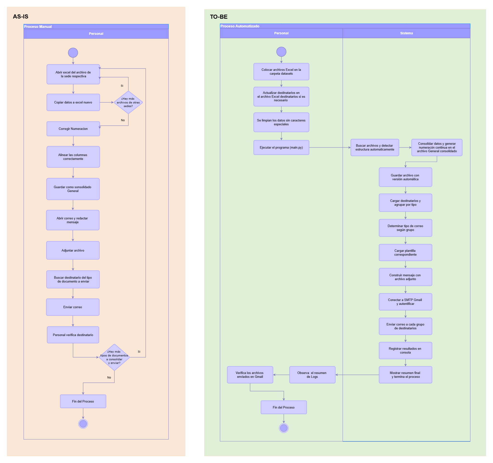

# Script de Automatización con Pyhton de Consolidación y Envío de Reportes de Programación en Excel

## Descripción General
Este proyecto consiste en un script desarrollado en Python que automatiza el proceso de consolidación de archivos Excel de programación y el envío masivo de correos electrónicos con el reporte consolidado. La herramienta permite leer múltiples archivos conun mismo formato, consolidarlos en un único archivo, personalizar las plantillas de correo según el tipo de destinatario y enviar los reportes de forma automatizada, generando además un registro de auditoría detallado de cada acción.

**Las 4 tareas principales del sistema:**
- Leer y procesar múltiples archivos Excel
- Consolidar automáticamente los datos en un único archivo
- Personalizar el correo según el tipo de destinatario (programación o guardia)
- Enviar correos con el archivo adjunto y registrar cada acción

**Capacidad del sistema:**
- Manejo de archivos Excel con estructuras variables (detección automática de formato)
- Generación de versiones consecutivas diferenciados por numero de version
- Envío por grupos según tipo de destinatario
- Envio en cuentas personales (Gmail, Hotmail) cuenta con una capacidad de hasta 500 envíos diarios
- Envio en cuentas corporativas cuenta con una capacidad hasta 2000 envíos diarios

## Tipos de Correos Generados
El sistema utiliza plantillas personalizadas según el tipo de destinatario, que se definen en el archivo de destinatarios.

- Correo tipo Programación: Diseñado para el personal administrativo y de programación. Incluye el reporte consolidado completo de todas las sedes con la información detallada de programación.

- Correo tipo Guardia: Orientado al personal de seguridad y guardia. Incluye el reporte específico de programación para el personal de guardia.

Ambas plantillas son completamente personalizables desde el archivo plantillas_correo.py, donde se puede modificar el texto, asunto y estructura según los requerimientos, en este caso se aplicaron formatos basicos.

## PROBLEMATICA
En toda organización, la información suele estar dispersa en múltiples archivos. Cada área genera sus propios reportes, y cuando se necesita consolidarlos para enviarlos a diferentes grupos, el proceso se vuelve manual y tedioso.
Un colaborador debe abrir cada archivo, copiar los datos, pegarlos en uno solo, corregir los errores que surgen al combinar (como números desordenados), sin contar que si son demasiados datos Excel puedo no aguantar haciendo caer a la aplicacion generando mas problemas, luego redactar correos personalizados para cada grupo de destinatarios, verifica que la direccion de los correos es correcta, adjuntar el o los archivos y enviar. Este ciclo se repite periódicamente.

En el sector salud, la programación de personal se gestiona en archivos Excel separados por cada sede. El área de recursos humanos necesita consolidar estos archivos en un reporte único y enviarlo a diferentes grupos de destinatarios (personal de programación general y personal de guardia). Cada grupo requiere un mensaje personalizado.
Actualmente, una persona dedica entre 20 y 30 minutos dependiendo de la cantidad de archivos a consolidar cada vez que debe realizar esta tarea, con el riesgo constante de que haya errores al combinar los archivos o de enviar el mensaje incorrecto al grupo equivocado.

El proceso manual implica:
1. Abrir cada archivo de sede 
2. Copiar y pegar los datos en un archivo consolidado
3. Corregir la numeración y formatos que quedan desordenados al combinar los archivos
4. Guardar el archivo consolidado
5. Redactar los correos personalizados para cada tipo de grupo a enviar los consolidados
6. Adjuntar el archivo y enviar

Errores que pueden ocurrir en estos procesos manuales:
- Se pierde tiempo valioso en tareas repetitivas
- Aparecen errores manuales: números mal ordenados, riesgo de adjuntar archivo incorrecto o enviar a destinatario equivocado, errores en los formatos
- No queda registro de qué se envió, a quién y cuándo, no existe una auditoria
- Si la persona encargada falta, este proceso se retrasaa y se detiene

## Proceso Actual (AS-IS)
El flujo manual actual requiere múltiples intervenciones humanas, cada una con riesgo de error.

## Proceso Automatizado (TO-BE)
Con la automatización, todo el proceso se ejecuta con una sola ejecución. El sistema se encarga de la consolidación, versionado, personalización y envío.

## Comparativa de Procesos: AS-IS vs TO-BE
La siguiente comparación evidencia la transformación del proceso, mostrando la reducción de pasos manuales, la eliminación de cuellos de botella y el impacto directo en la eficiencia operativa.

## Componentes del Sistema
<table>
  <thead>
    <tr>
      <th>Módulo / Archivo</th>
      <th>Responsabilidad</th>
    </tr>
  </thead>
  <tbody>
    <tr>
      <td><code>main.py</code></td>
      <td>Orquestador principal: coordina consolidación, carga destinatarios y envía correos</td>
    </tr>
    <tr>
      <td><code>consolidacion.py</code></td>
      <td>Detecta estructura de archivos Excel, consolida datos y genera versiones numeradas</td>
    </tr>
    <tr>
      <td><code>enviar_email.py</code></td>
      <td>Construye mensaje con adjunto MIME y envía vía SMTP (Gmail)</td>
    </tr>
    <tr>
      <td><code>config/credentials.py</code></td>
      <td>Almacena credenciales SMTP para autenticación</td>
    </tr>
    <tr>
      <td><code>config/plantillas_correo.py</code></td>
      <td>Define plantillas de asunto y cuerpo según tipo de destinatario</td>
    </tr>
    <tr>
      <td><code>config/destinatarios.xlsx</code></td>
      <td>Lista de correos electrónicos agrupados por tipo (programación/guardia)</td>
    </tr>
    <tr>
      <td><code>datasets/</code></td>
      <td>Contiene archivos fuente (ProgramacionSede*.xlsx) y consolidados generados (ProgramacionGeneral_*.xlsx)</td>
    </tr>
  </tbody>
</table>

